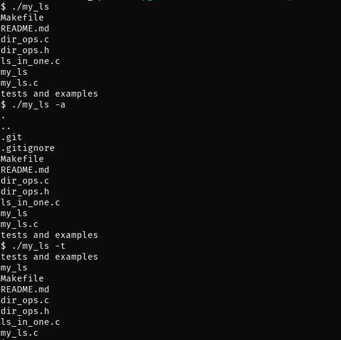

# My Ls
***

## Summary 
This program is an implementation of the Linux 'ls' command that shows the names of the files in a specified directory. 
The command options are available: 

-a: includes hidden files and directories

-t: sorts files by time modified from most recent to latest

## Usage 
my_ls has the following functionality when run with certain command line arguments:

1. ./my_ls : Displays the current directory entries (.)

2. ./my_ls -a : Displays the current directory entries including the hidden files

3. ./my_ls -t : Displays the current directory entries sorted by time modified

4. ./my_ls -a -t or -ta or -at or -t -a : Displays the current current directory entries including the hidden files
sorted by time modified

5. ./my_ls [-at][dir1, dir2, ...] : Displays the name of the directory and then the directory entries. 
If -a is provided, the hidden files are displayed. If -t is provided, the entries are sorted by time modified.

## Installation
Run **make** to compile the program and generate the executable file **my_ls**. The program requires my_ls.c and dir_op.c. 

## Description 
The program sequence is as follows: 

1. Parse the optional arguments (-at) and set the appropriate flag variables (aflag, tflag).

2. Parse the non-option arguments (paths) and store them in an array. Sort the array.
If there are no non-option arguments or invalid directories, display the current directory's entries. 

3. For each directory (or current directory), get the entries, sort the entries,
and print the entries. 
